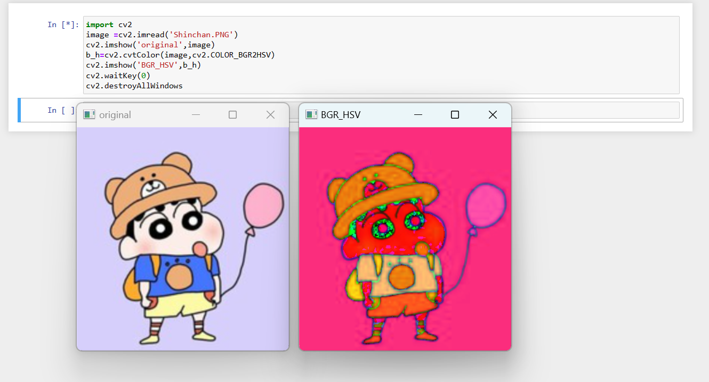
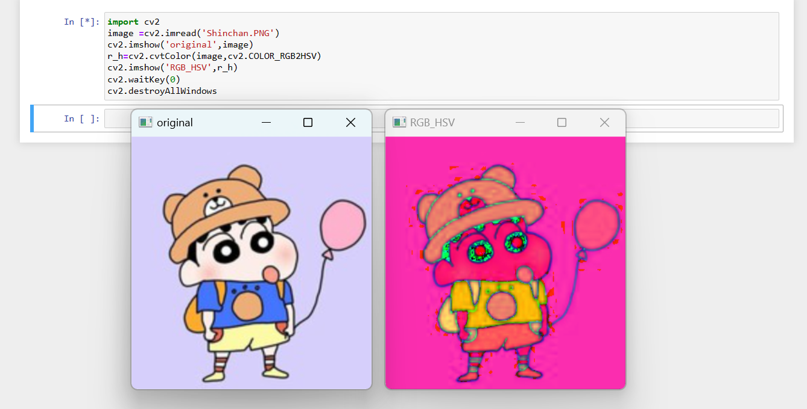
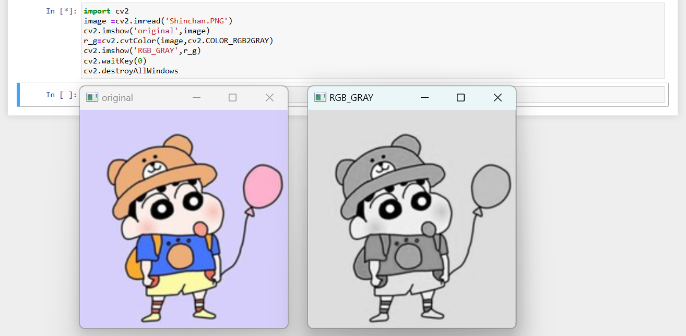
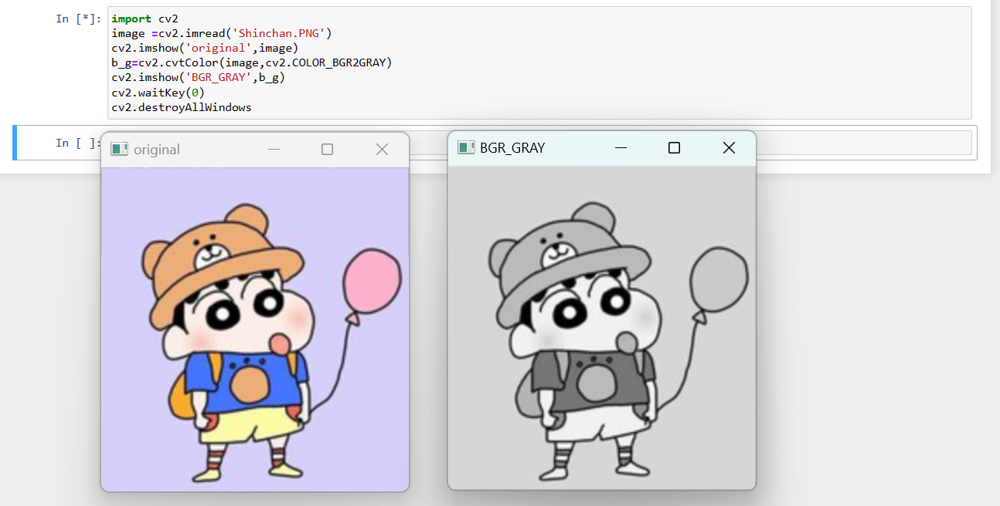
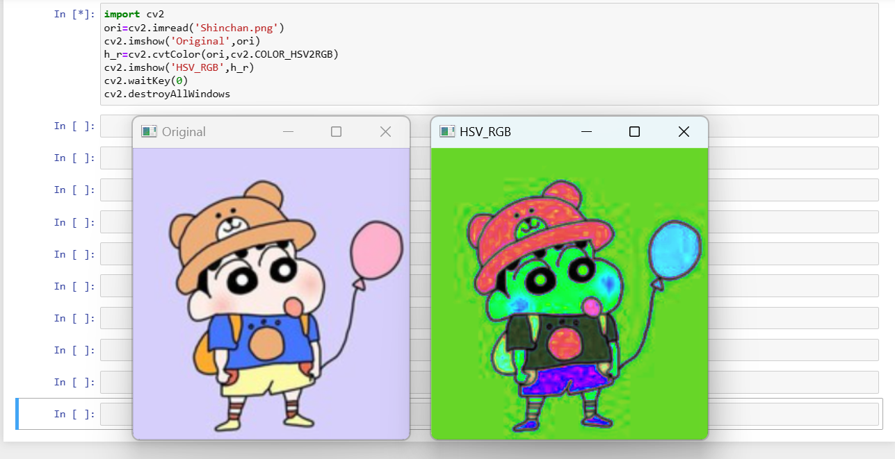
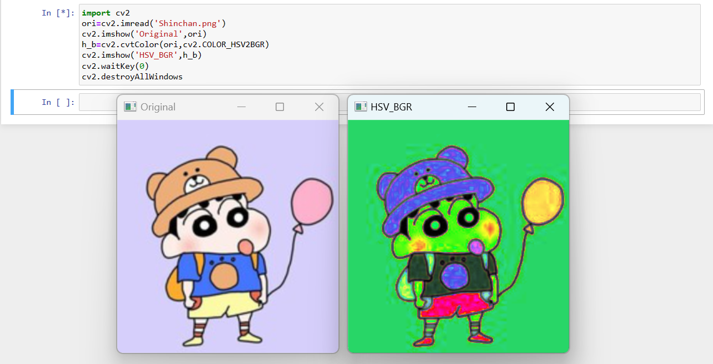
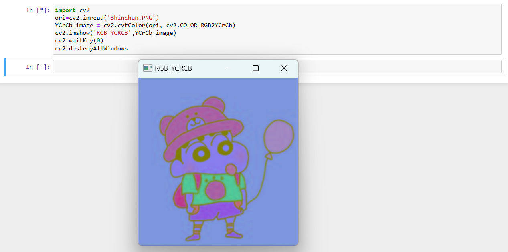
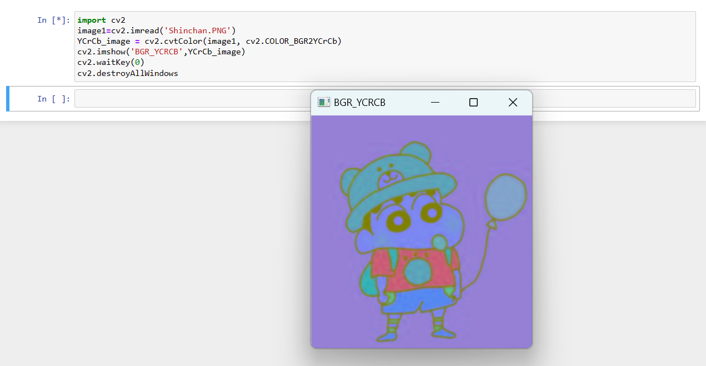
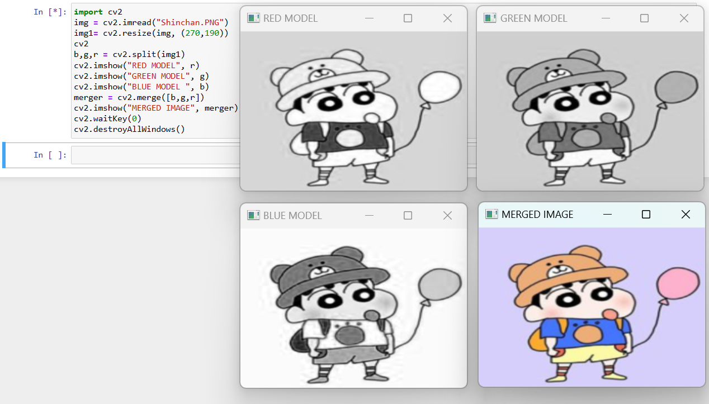
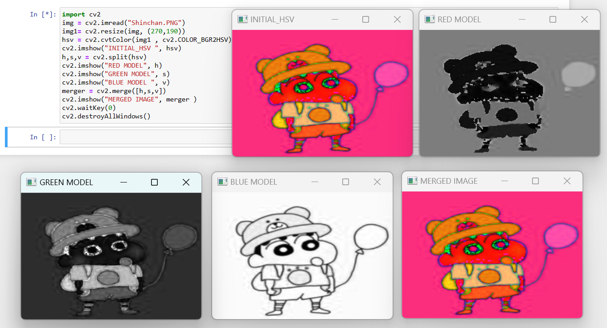

# Color Conversion

## AIM:
To perform the color conversion between RGB, BGR, HSV, and YCbCr color models.

## SOFTWARE REQUIRED:
Anaconda - Python 3.7

## ALGORITHM:
### STEP 1:
Import cv2 library and upload the image or capture an image.
### STEP 2:
Read the saved image using cv2.imread("filename.jpg").
### STEP 3:
Convert the image into the given color transformation using cv2.cvtColor(image, cv2.BGR2YCrCb) and similarly for other color formats.
### STEP 4:
Split and merge the image using cv2.split(hsv) and cv2.merge([h,s,v])
### STEP 5:
Output the image using cv2.imshow("OUTPUT", image)

## PROGRAM:
```
 Developed By: Paarkavy B
 Register Number: 212221230072
 ```

# i) Convert BGR and RGB to HSV and GRAY

## BGR TO HSV
```
import cv2
image =cv2.imread('Shinchan.PNG')
cv2.imshow('original',image)
b_h=cv2.cvtColor(image,cv2.COLOR_BGR2HSV)
cv2.imshow('BGR_HSV',b_h)
cv2.waitKey(0)
cv2.destroyAllWindows
```

## BGR TO GRAY
```
import cv2
image =cv2.imread('Shinchan.PNG')
cv2.imshow('original',image)
r_h=cv2.cvtColor(image,cv2.COLOR_RGB2HSV)
cv2.imshow('RGB_HSV',r_h)
cv2.waitKey(0)
cv2.destroyAllWindows
```

## RGB TO HSV
```
import cv2
image =cv2.imread('Shinchan.PNG')
cv2.imshow('original',image)
r_g=cv2.cvtColor(image,cv2.COLOR_RGB2GRAY)
cv2.imshow('RGB_GRAY',r_g)
cv2.waitKey(0)
cv2.destroyAllWindows
```

## RGB TO GRAY
```
import cv2
image =cv2.imread('Shinchan.PNG')
cv2.imshow('original',image)
b_g=cv2.cvtColor(image,cv2.COLOR_BGR2GRAY)
cv2.imshow('BGR_GRAY',b_g)
cv2.waitKey(0)
cv2.destroyAllWindows
```

```
import cv2
img= cv2.imread('Shinchan.PNG')
hsv=cv2.cvtColor(img,cv2.COLOR_BGR2HSV)
cv2.imwrite('hsv-n1.png',hsv)
```

# ii)Convert HSV to RGB and BGR

## HSV TO RGB
```
import cv2
ori=cv2.imread('Shinchan.png')
cv2.imshow('Original',ori)
h_r=cv2.cvtColor(ori,cv2.COLOR_HSV2RGB)
cv2.imshow('HSV_RGB',h_r)
cv2.waitKey(0)
cv2.destroyAllWindows
```

## HSV TO BGR
```
import cv2
ori=cv2.imread('Shinchan.png')
cv2.imshow('Original',ori)
h_b=cv2.cvtColor(ori,cv2.COLOR_HSV2BGR)
cv2.imshow('HSV_BGR',h_b)
cv2.waitKey(0)
cv2.destroyAllWindows
```

# iii)Convert RGB and BGR to YCrCb

## RGB TO YCrCb
```
import cv2
ori=cv2.imread('Shinchan.PNG')
YCrCb_image = cv2.cvtColor(ori, cv2.COLOR_RGB2YCrCb)
cv2.imshow('RGB_YCRCB',YCrCb_image)
cv2.waitKey(0)
cv2.destroyAllWindows
```

## BGR TO YCrCb
```
import cv2
image1=cv2.imread('Shinchan.PNG')
YCrCb_image = cv2.cvtColor(image1, cv2.COLOR_BGR2YCrCb)
cv2.imshow('BGR_YCRCB',YCrCb_image)
cv2.waitKey(0)
cv2.destroyAllWindows
```

# iv)Split and Merge RGB Image

```
import cv2
img = cv2.imread('Shinchan.PNG')
img1= cv2.resize(img, (270,190))
cv2
b,g,r = cv2.split(img1)
cv2.imshow("RED MODEL", r)
cv2.imshow("GREEN MODEL", g)
cv2.imshow("BLUE MODEL ", b)
merger = cv2.merge([b,g,r])
cv2.imshow("MERGED IMAGE", merger )
cv2.waitKey(0)
cv2.destroyAllWindows()
```

# v) Split and merge HSV Image

```
import cv2
img = cv2.imread('Shinchan.PNG')
img1= cv2.resize(img, (270,190))
hsv = cv2.cvtColor(img1 , cv2.COLOR_BGR2HSV)
cv2.imshow("INITIAL_HSV ", hsv)
h,s,v = cv2.split(hsv)
cv2.imshow("RED MODEL", h)
cv2.imshow("GREEN MODEL", s)
cv2.imshow("BLUE MODEL ", v)
merger = cv2.merge([h,s,v])
cv2.imshow("MERGED IMAGE", merger)
cv2.waitKey(0)
cv2.destroyAllWindows()
```

## OUTPUT:
### i) BGR and RGB to HSV and GRAY

### BGR TO HSV


### BGR TO GRAY


### RGB TO HSV


### RGB TO GRAY


### ii) HSV to RGB and BGR

### HSV TO RGB


### HSV TO BGR


### iii) RGB and BGR to YCrCb

### RGB TO YCrCb


### BGR TO YCrCb


### iv) Split and merge RGB Image


### v) Split and merge HSV Image


## RESULT:
Thus the color conversion was performed between RGB, HSV and YCbCr color models.
